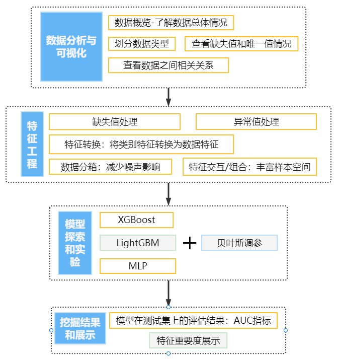

# Data-Mining-Course金融风控-贷款违约预测

数据挖掘课程项目

## 项目说明

本项目来自阿里云天池大赛赛题：[零基础入门金融风控-贷款违约预测-天池大赛-阿里云天池 (aliyun.com)](https://tianchi.aliyun.com/competition/entrance/531830/information)

赛题以金融风控中的个人信贷为背景，要求根据贷款申请人的数据信息预测其是否有违约的可能，以此判断是否通过此项贷款，这是一个典型的分类问题。赛题以预测用户贷款是否违约为任务，采用AUC作为评价指标。

## 项目总体流程

## 代码说明

- 数据分析与可视化：[data analysis&visualization.ipynb](https://github.com/Kayaks99/Data-Mining-Course/blob/main/data analysis%26visualization.ipynb)

- 特征工程/数据预处理：[feature.ipynb](https://github.com/Kayaks99/Data-Mining-Course/blob/main/feature.ipynb)
- 模型实现和实验结果：[run_lgb.ipynb](https://github.com/Kayaks99/Data-Mining-Course/blob/main/run_lgb.ipynb)、[run_mlp.py](https://github.com/Kayaks99/Data-Mining-Course/blob/main/run_mlp.py)、[run_xgb.ipynb](https://github.com/Kayaks99/Data-Mining-Course/blob/main/run_xgb.ipynb)

PS：程序中数据访问目录为`data/*`，需自行导入数据

